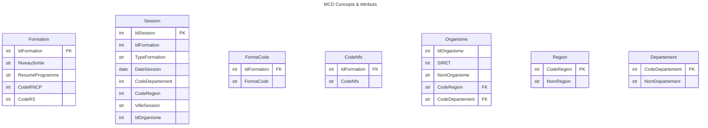

# brief_scraping_scrapy

## Contexte
...

## Objectifs
 - ...
 - ...
## Les données à scrapper
...

## Définition du modèle MCD (Modèle Conceptuel des Données)
### Les concepts
La prmière étape consiste à définr notre MCD, nous avons 

### Les attributs
Définition des attributs

## Les associations
 ****

